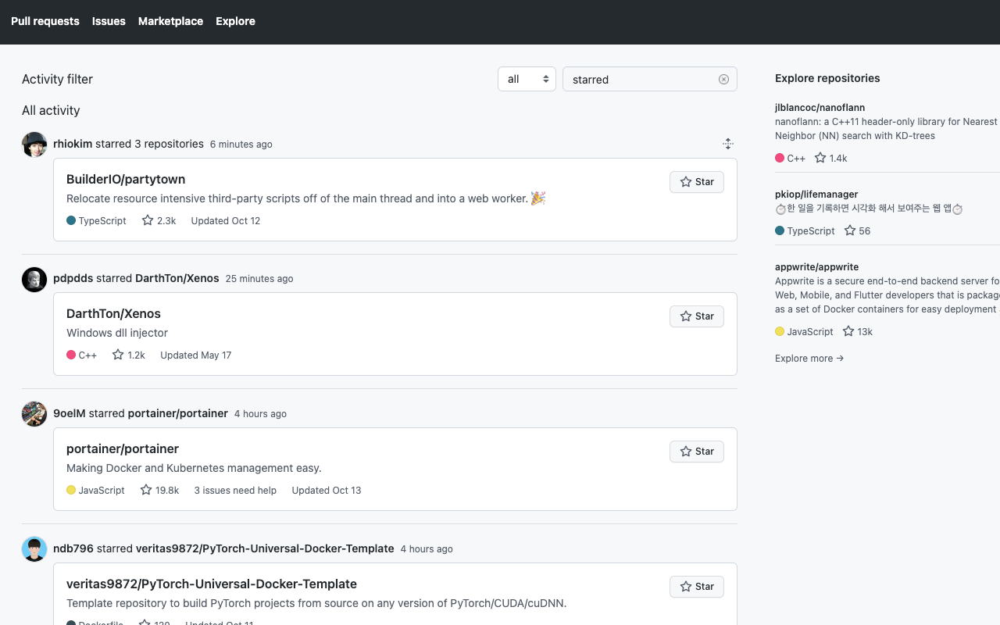

# github-activity-filter

> Add filtering feature to Github activity dashboard (`https://github.com/`)

## Icon sources

This lib uses below icon sources

<a target="_blank" href="https://icons8.com">Image</a> icon by <a target="_blank" href="https://icons8.com">Icons8</a>
